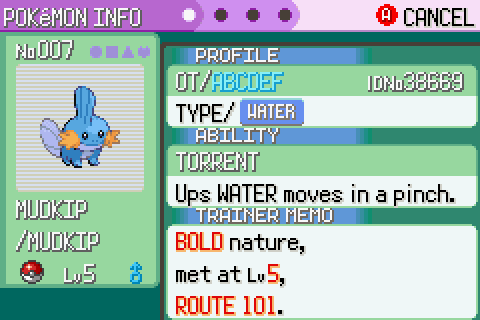
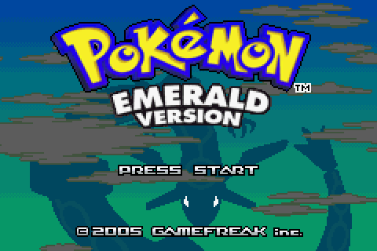
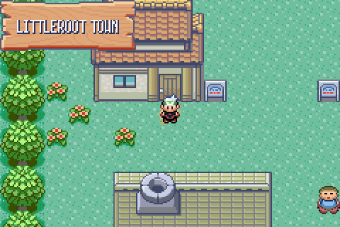
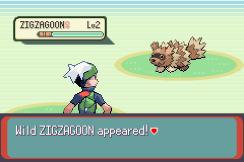
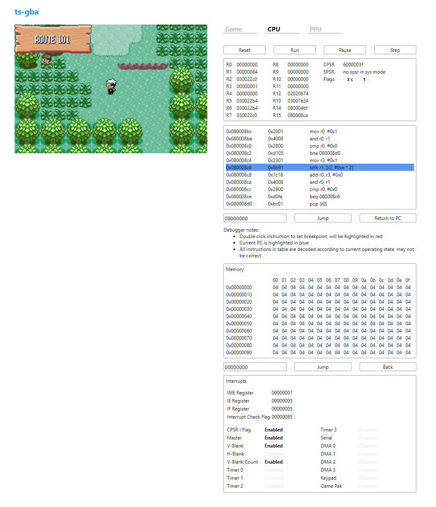
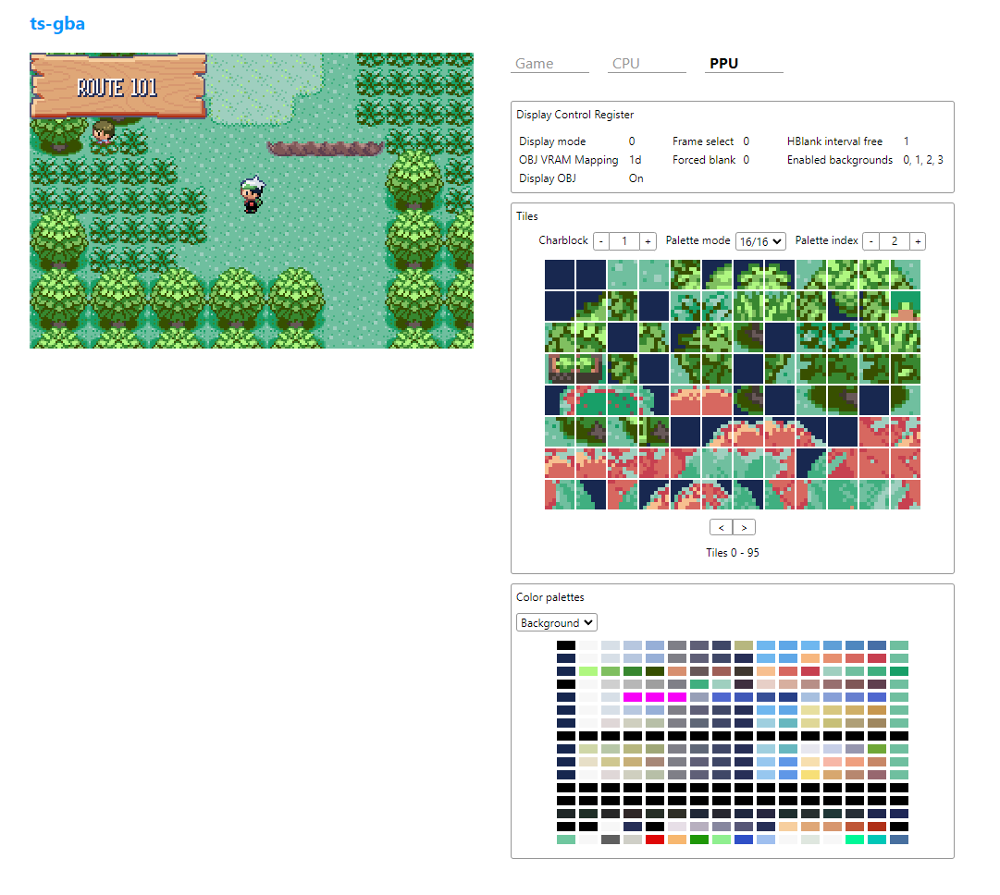

### ts-gba



A GameBoy Advance emulator written in TypeScript that runs in the browser.

### Setup
ts-gba uses tsc and esbuild to compile and bundle the TypeScript source into a single JavaScript file. This file is referenced by the `index.html` file to call emulator functions from within the HTML UI.

```
> git clone git@github.com:SkylerRankin/ts-gba.git
> cd ts-gba

> npm install
> npm test
> npm run build_web

> ls dist
dist
├── index.html
└── tsgba.js
```


To run the emulator, open or host file at `ts-gba/dist/index.html`. From there, upload a ROM and optionally a BIOS file and/or save file. Press `Start` to begin the game, and press `Pause` under the CPU tab to use debugging tools.

### Status

The project currently implements enough of the GBA features to play Gen 3 Pokemon games (see Emerald and Fire Red in screenshots). Game saves can be downloaded/uploaded as files or saved/loaded from local storage.

Next Steps:
- Improve framerate
- Support GPIO devices (RTC is used for clock stuff in Pokemon, but not necessary to run game)
- Support other cartridge save types (currently only 128KB flash memory)
- Implement audio
- Graphical bugs (e.g. occasional sprite priority issues)

### Screenshots






### Debugger

This project includes a few basic debugging tools, listed below.
* CPU register, CPSR, and SPSR viewer
* Instruction disassembly with steps and breakpoints
* Byte level memory viewer
* Status of all the interrupt configurations
* Display control status
* View of tiles in VRAM, divided into character-blocks, with palette and bit-depth controls
* Background and object palette color viewer

Examples of debugger running in game:




### Acknowledgements

The following resources were essential in making this project possible.
- [GBATEK](https://www.akkit.org/info/gbatek.htm): The comprehensive GBA technical reference. Pretty much all concepts and hardware details needed to understand the GBA are documented here. 
- [The official ARM Architecture Reference Manual](https://www.intel.com/content/dam/www/programmable/us/en/pdfs/literature/third-party/archives/ddi0100e_arm_arm.pdf): Contains everything needed to implement the ARMv4T instruction set.
- [Tonc](https://www.coranac.com/tonc/text/toc.htm): A detailed series covering the most important aspects of GBA game programming. The demos provided were essential in being able to test GBA features in small, isolated pieces of code.
- [No$ GBA](https://www.nogba.com/): An excellent GBA emulator that provides lots of debugging UI. The ability to step through instructions in No$ and compare the state to my emulator was critical in debugging and saved hours of time.
